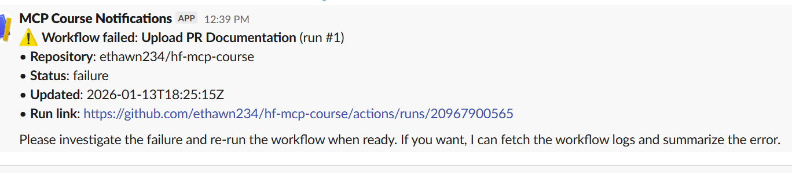
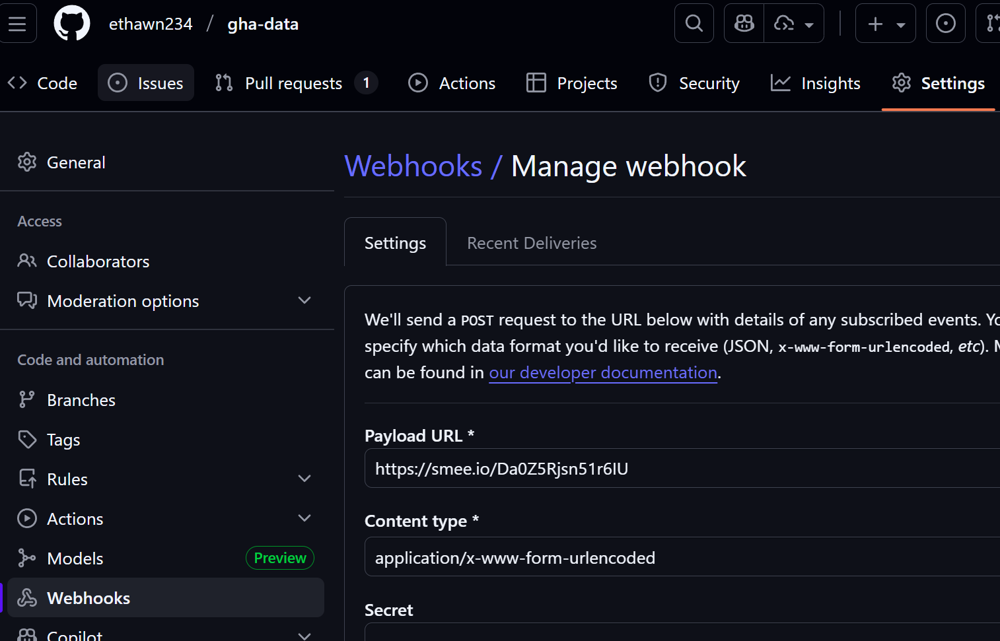

# Notes during Implementation of **pr-agent** MCP Server

---

## 1/13/26

### Todos

- Add a prompt for sending Slack Notifications.

-  Validation post-notification tool implementation
  1. Run unit test validation post-notification tool implementation.
    - Remember to install packages with `uv sync --all-extras`.
      - Original install with `uv sync --all-extras` failed library import: `"Could not find anyio"` package despite existing in `uv.lock`.
  2. Validated in MCP Inspector: Added message and successfully sent to Slack.
  3. Validated that Copilot can send slack notification.

- Add integration for Slack notification.
  - We have permission to dl public slack. See https://perficient.sharepoint.com/sites/connect/Lists/FAQs/DispForm.aspx?ID=286

- [Exercise 3: Notification System](https://huggingface.co/learn/mcp-course/unit3/github-actions-integration#exercise-3-notification-system)
    
    Add a tool that:

      1. Tracks which events have been “seen”
      2. Highlights new failures
      3. Suggests which team member to notify

### Issues & Gotchas

- POST to Slack for notifications required specific key in `payload: { text: message }`. Not sure if this is a Python thing.
- Don't forget to configure the dotenv module before using env vars.

- The prompts should define a clear order for which tasks to run for the Agent. It should also include a standard summary report format.
  - Just using the solution templates for now.

- The prompt `analyze_ci_results` currently prompts the user to enter the `working_directory` which is the path to the repo for which the Agent will examine.
  - This is due to the decorator `@mcp.prompt` which has customization options.
  - **This prompt should be on a per-repo basis**. This means the db will hold workflow runs for that repo only.
    - Prompt should only request the user input for example a workflow run or name that should be examined.
    - This will also require refactoring `webhook_server.py` to only fetch runs for the given repo (via key like `repository`).

- Fix the 'db' currently holding the list of workflow runs and filtered workflow runs.
  - This db currently lives within this repo. It should be accessible to all repos.

- Constraints with working directory
  
  - VSCode expects the MCP config for pr-agent to be within a repo. That's fine but I also want users to be able to place it in their User Profile and let Agents figure out the working directory based on the open repo.
    - Current working solution is to require the `working_directory` arg to `analyze_file_changes` and Copilot should be able to automatically provide that path. From testing, Sonnet 4.5 figured it out on the first try; GPT5 and Raptor Mini needed additional prompting or iteration to get the path arg correct.
    - For future, the alternate configuration for pr-agent may enable or make easier the ability to declare the `roots` for clients like VSCode/Copilot.
      - Remove the `--directory` arg and add it to the `cwd` field. This previously points to the server's folder.
      - The `roots` may be possible if declared in `inputs` or `env` or some other field. Need more research.

---

## 1/12/26

---

### Issues

- The working directory is not correctly being applied in some cases. This should have been fixed by requiring `working_directory` when calling `analyze_file_changes`.
  - Keep in mind that while I don't have the ability to specify cwd when testing, AI Agents may be able to specify their cwd.
  - extracted helper for fetching the cwd from `working_directory`.
  - **Currently defaulting to MCP server's directory**

### Timeline
- webhook_server.py is provided but how is it connected to github?
  - Do I need to add the webhook config to github? If so, I will need to use the smee forwarder since github webhooks cannot post to localhost.

  - Run webhook forwarder:
  
  `smee --url https://smee.io/Da0Z5Rjsn51r6IU --path /webhook/github --port 8080`

## Flow for Slack/Copilot integration for GitHub Action Run failures

1. Create the smee proxy and add that url to the target repo. This proxy will forward GitHub Action Runs and Jobs events to the webhook.
2. Configure the webhook_server.py. This server will take those forwarded events and write them to a JSON file.
3. In your Slack account, create an app with `incoming_webhook` scope. On creating the app, a URL to this slack app is generated. Add this URL to `.env` with a key of `SLACK_WEBHOOK_URL`. This URL is used by the mcp tool `send_slack_notification` to allow Agents to send messages to your slack workspace.
4. Create the mcp tool `send_slack_notification` that will post to the slack app URL. A payload containing the notification message: `{ "text": "message" }` will be sent to your configured slack channel.
5. Start the webhook server, proxy server, and trigger some GitHub Action runs, preferably ones that will fail. The events should be recorded in the JSON as they come in.
6. Validate unit tests, Agent usage, and in MCP Inspector.

### Success

## Generic Webhook Event Flow (with Flow for Jira/Coding Agent integration for Dependabot Alerts)

1. Create and start smee proxy to forward Github events to local server. 
    - This is required because Github does not allow posting to localhost.
    - The cmd to start the proxy has a `--path` option to define the route handler path smee will forward the github event.

2. Create and start the local server that handles the github events forwarded by smee.
    - The event handler function triggers on requests directed to `localhost:<port>/webhook/github`.

3. Add the generated proxy url from smee to the desired git repo. 
    - This can also be enabled at an org-level.
    - Configure the desired events to send.
    - Once all 3 components are activated, github events will be forwarded to the proxy, forwarded to local server, and gha action runs written to file.

      